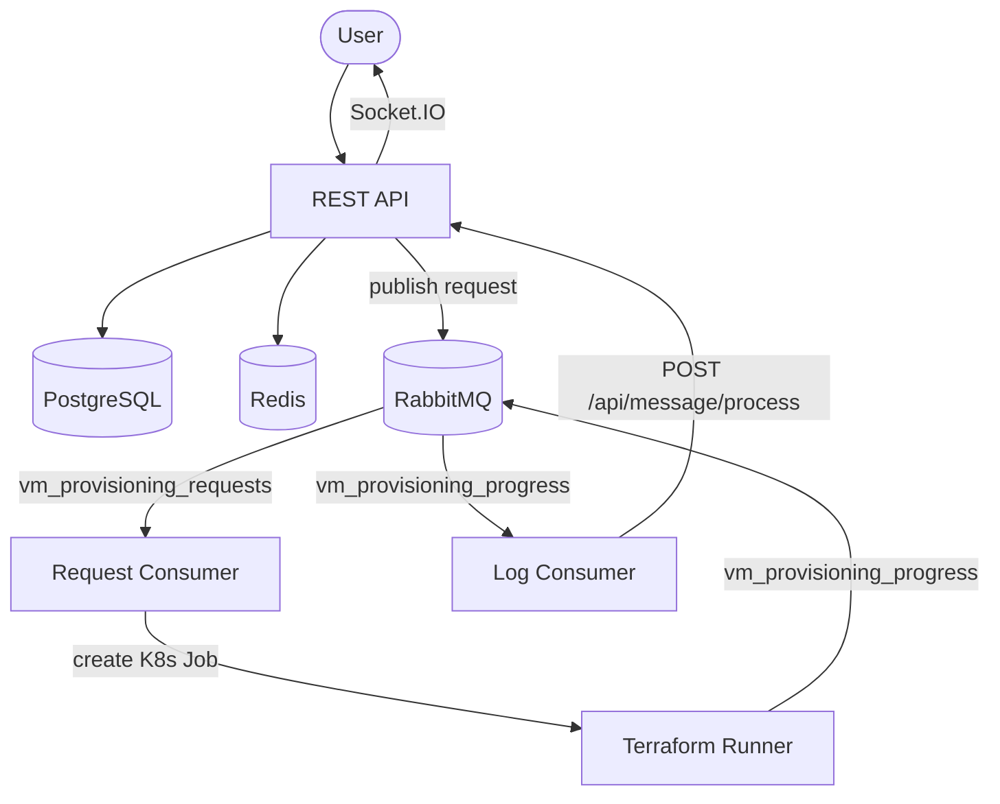

# VM Provisioning - Backend

Backend services for the NAIC VM Provisioning platform. Orchestrates Terraform-based infrastructure provisioning across multiple cloud providers via a microservices architecture deployed on Kubernetes.

**Frontend:** [NAICNO/vm-provision-frontend](https://github.com/NAICNO/vm-provision-frontend)

## Architecture

### Components

| Component | Description |
|-----------|-------------|
| `rest/` | Express.js REST API with Socket.IO, Prisma ORM, Redis sessions |
| `provision-request-queue-consumer-pod/` | Consumes provisioning requests from RabbitMQ, prepares Terraform configs, creates K8s jobs |
| `provision-log-queue-consumer-pod/` | Consumes Terraform JSON logs from RabbitMQ and forwards to the REST API |
| `terraform-runner-job/` | K8s Job container (Terraform + Python) that runs Terraform and pipes output to RabbitMQ |
| `gcp/gke/` | Kubernetes deployment manifests |

### Request Consumer

Consumes from the `vm_provisioning_requests` queue. For each request it copies provider-specific HCL templates and cloud-init files to a shared NFS volume, generates `terraform.tfvars`, and creates a Kubernetes job running the Terraform runner image.

**Supported actions:**

| Action | Terraform Command |
|--------|-------------------|
| `CREATE` | `terraform init && terraform apply -auto-approve -json` |
| `DESTROY` | `terraform init && terraform destroy -auto-approve -json` |
| `REFRESH` | `terraform init && terraform refresh -json` |

### Supported Providers

| Provider | HCL Directory | Required Credentials |
|----------|---------------|---------------------|
| NREC | `hcl/nrec/` | `OS_USERNAME`, `OS_PASSWORD`, `OS_PROJECT_NAME` |
| NREC UiO | `hcl/nrec-uio/` | Same as NREC (different project) |
| NREC UiB | `hcl/nrec-uib/` | Same as NREC (different project) |
| Google Cloud | `hcl/google-cloud/` | `GOOGLE_APPLICATION_CREDENTIALS` |
| Azure | `hcl/azure/` | `ARM_CLIENT_ID`, `ARM_CLIENT_SECRET`, `ARM_TENANT_ID`, `ARM_SUBSCRIPTION_ID` |
| IBM Cloud | `hcl/ibm-cloud/` | `IC_API_KEY`, `TF_VAR_cloud_instance_id` |
| Nscale | `hcl/nscale/` | `TF_VAR_nscale_service_token`, `organization_id`, `project_id`, `region_id` |

Provider credentials are mounted as Kubernetes secrets into Terraform runner jobs. See `provision-request-queue-consumer-pod/src/providers.ts` for the full mapping.

**Adding a new provider:**

1. Create a directory under `provision-request-queue-consumer-pod/hcl/` with `main.tf` and `variables.tf`
2. Define required Terraform outputs: `vm_ip` and `vm_provision_status`
3. Add a cloud-init template to `hcl/cloud-init/` if the default doesn't work
4. Register the provider in `src/providers.ts` with its env vars and secrets
5. Add provider and VM templates to the database via `data/vm_templates.sql`

## Documentation

- [Local Development](docs/DEVELOPMENT.md) — setup, environment variables, testing
- [Deployment](docs/DEPLOYMENT.md) — Docker builds, Kubernetes manifests, deployment order

## License

This project is licensed under the MIT License - see the [LICENSE](LICENSE) file for details.
