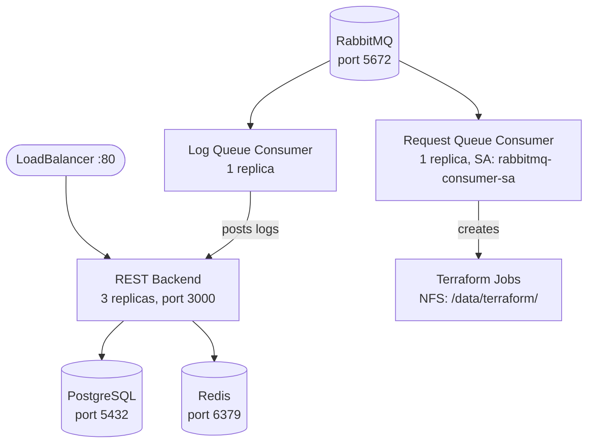

# Deployment

## Building Docker Images

Each service has its own Dockerfile. A template build script is provided at [`build-push.sh.example`](../build-push.sh.example) — copy it into the service directory, update the configuration variables, and run it.

```bash
cp build-push.sh.example rest/build-push.sh
# Edit rest/build-push.sh with your registry, kubectl context, and deployment name
cd rest && ./build-push.sh
```

Repeat for each service:
- `rest/`
- `provision-log-queue-consumer-pod/`
- `provision-request-queue-consumer-pod/`
- `terraform-runner-job/`

## Kubernetes Deployment

Manifests are in `gcp/gke/`. Update the container image references in the deployment files to point to your Docker registry before applying.

### Cluster Topology



### Required Secrets

Create these before deploying:

```bash
kubectl create secret generic postgres-secret \
  --from-literal=username=<db-user> \
  --from-literal=password=<db-password>

kubectl create secret generic rabbitmq-secret \
  --from-literal=username=<rmq-user> \
  --from-literal=password=<rmq-password>

kubectl create secret generic redis-secret \
  --from-literal=password=<redis-password>

kubectl create secret generic api-key-secret \
  --from-literal=api-key=<inter-service-api-key>
```

### Deployment Order

1. **Secrets** — create all secrets listed above
2. **Storage** — apply storage class, PVCs, and NFS share
3. **Data stores** — deploy PostgreSQL, RabbitMQ, Redis
4. **Service account** — apply `rabbitmq-consumer-service-account.yaml`
5. **REST backend** — deploy the API (depends on data stores)
6. **Consumers** — deploy log and request queue consumers (log consumer posts to the REST API)

```bash
cd gcp/gke

# Storage
kubectl apply -f filestore-storage-class.yaml
kubectl apply -f postgres-pvc.yaml -f rabbitmq-pvc.yaml -f redis-pvc.yaml
kubectl apply -f google-filestore/  # or custom-nfs-share/

# Data stores
kubectl apply -f postgres-deployment.yaml -f postgres-services.yaml
kubectl apply -f rabbitmq-deployment.yaml -f rabbitmq-service.yaml
kubectl apply -f redis-deployment.yaml -f redis-service.yaml

# RBAC
kubectl apply -f rabbitmq-consumer-service-account.yaml

# Application
kubectl apply -f rest-backend-deployment.yaml -f rest-service.yaml
kubectl apply -f provision-log-queue-consumer-deployment.yaml
kubectl apply -f provision-request-queue-consumer-deployments.yaml
```

### Manifests Reference

**Application:**

| File | Resource | Description |
|------|----------|-------------|
| `rest-backend-deployment.yaml` | Deployment | REST API — 3 replicas, rolling updates, health/readiness probes |
| `rest-service.yaml` | Service (LoadBalancer) | Exposes REST API on port 80 with session affinity |
| `provision-log-queue-consumer-deployment.yaml` | Deployment | Consumes Terraform logs from RabbitMQ |
| `provision-request-queue-consumer-deployments.yaml` | Deployment | Consumes provisioning requests, spawns Terraform K8s jobs |
| `rabbitmq-consumer-service-account.yaml` | ServiceAccount + Role + RoleBinding | Grants the request consumer permission to create K8s batch jobs |

**Data stores:**

| File | Resource | Description |
|------|----------|-------------|
| `postgres-deployment.yaml` | Deployment | PostgreSQL 16.4 — credentials from `postgres-secret` |
| `postgres-pvc.yaml` | PVC (10Gi) | Persistent storage for PostgreSQL |
| `postgres-services.yaml` | Services | `postgres-internal` (ClusterIP) + `postgres-external` (LoadBalancer) |
| `rabbitmq-deployment.yaml` | Deployment | RabbitMQ 3 with management console — credentials from `rabbitmq-secret` |
| `rabbitmq-pvc.yaml` | PVC (10Gi) | Persistent storage for RabbitMQ |
| `rabbitmq-service.yaml` | Service (LoadBalancer) | Ports 5672 (AMQP) + 15672 (management) |
| `redis-deployment.yaml` | Deployment | Redis 7.4 with AOF persistence — password from `redis-secret` |
| `redis-pvc.yaml` | PVC (1Gi) | Persistent storage for Redis |
| `redis-service.yaml` | Service (ClusterIP) | Internal-only access on port 6379 |

**Shared storage (Terraform working directory):**

| Directory | Type | Capacity | Use Case |
|-----------|------|----------|----------|
| `google-filestore/` | Google Filestore NFS | As required | Production — managed GCP Filestore instance |
| `custom-nfs-share/` | Custom NFS server | As required | Alternative — self-managed NFS |

Both provide `ReadWriteMany` access so multiple Terraform jobs can read/write state concurrently. `filestore-storage-class.yaml` defines the StorageClass used by both options.
